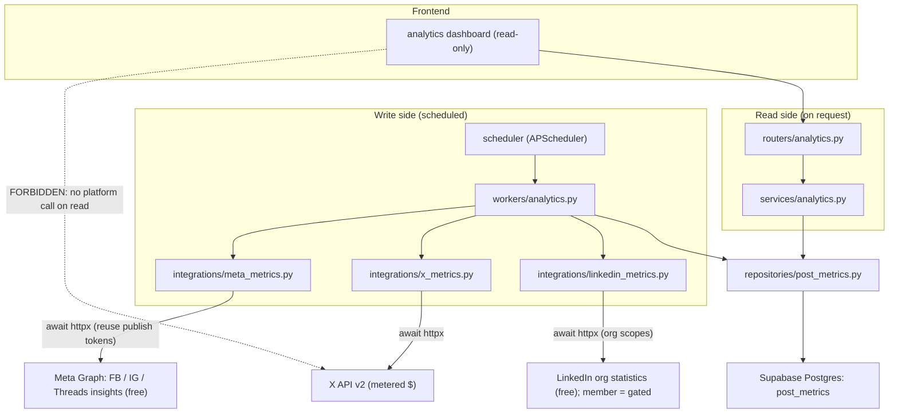
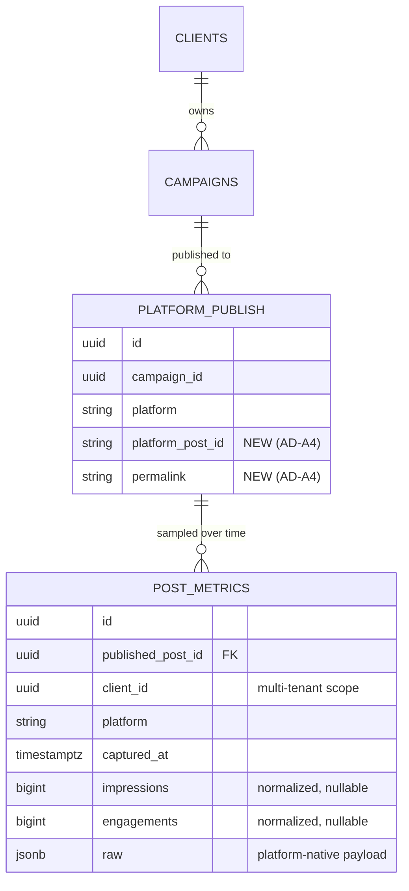

# Architecture Spine — Post Analytics & Performance Tracking (Phase 2 / v2)

> **Fast-path draft.** Every non-obvious call I couldn't settle from the parent architecture or verified platform facts carries an `[ASSUMPTION]` tag for you to correct in review. The load-bearing forks (pull-vs-push, snapshot store, cost governance, the asymmetric platform matrix) are decided in AD blocks below.

## Design Paradigm

**Scheduled Harvester + Append-Only Snapshot Store** — the deliberate **inverse** of the rest of PersonnaPress. Everything else is *push*: a user event triggers generation, then a publish. Analytics is *pull*: no platform pushes engagement data, so a scheduled sweep reads it on a cadence and appends immutable snapshots. A CQRS-lite split falls out of this:

- **Write side (collector):** an APScheduler-driven sweep (`workers/analytics.py`) reads platform metrics via `httpx` and *appends* time-series rows. It never mutates prior rows and never runs on a user request.
- **Read side (projection):** the dashboard reads *only* stored snapshots; `services/analytics.py` projects them into display rollups with cheap SQL. No platform API is ever touched on the read path.

Layers map onto the existing layered backend unchanged: `routers/analytics.py` (thin) → `services/analytics.py` (read/rollup) · `scheduler` → `workers/analytics.py` (collect) → `integrations/{x,linkedin}_metrics.py` → `repositories/post_metrics.py`.

## Inherited Invariants

These bind here by their **original** ids/names from `architecture.md` — read-only, not re-derived. A local decision that weakens one is a conflict to surface, not an override.

| Inherited | From parent | Binds here |
| --- | --- | --- |
| Router → Service → Repository → Integration layering (routers thin, integrations = one external API, no business logic) | architecture.md §Structure Patterns | All new analytics files |
| `snake_case`-through contract (DB cols → API JSON → TS types) | architecture.md §Format Patterns | `post_metrics` columns, `/api/v1/analytics` responses, TS types |
| Auth: JWT httpOnly cookie, `get_current_user` on every protected route | architecture.md §Auth | `GET /api/v1/analytics/*` |
| **Job durability**: a persistent `jobs` record before every BackgroundTask/scheduled task; APScheduler `SQLAlchemyJobStore` → Supabase Postgres, recovers on restart | architecture.md §3 cross-cutting | The `metrics_poll` sweep (AD-A1) |
| Error shape `{"error":{"code","message","detail"}}`; SCREAMING_SNAKE_CASE codes | architecture.md §Error Standard | `METRICS_*` codes |
| Outbound rate-limit mitigation: staggered per-platform calls (2s X, 5s LinkedIn) | architecture.md §7 | Harvester outbound reads (AD-A2) |
| **Cost control**: per-user external usage logged; hard limit enforced *before* the action | architecture.md §9 (`generation_logs`) | Metered X reads (AD-A6) |
| Supabase Postgres/Storage backend-only; frontend never queries platform or DB directly | architecture.md §Boundaries | Dashboard read path |
| Subscription tier enforcement before any create/generate action | architecture.md §2 | Poll-budget gate (AD-A6) `[ASSUMPTION: analytics is a paid-tier capability]` |
| Multi-tenancy: all data scoped to `client_id` under a `user_id` | architecture.md §Data | `post_metrics.client_id`, dashboard filtering |
| slowapi 10 req/min/user | architecture.md §API | Analytics read endpoints |

## Invariants & Rules

### AD-A1 — Metrics are pulled on a schedule; never fetched on request

- **Binds:** collection pipeline (`scheduler`, `workers/analytics.py`), dashboard read path
- **Prevents:** a builder calling a platform API synchronously on dashboard load (adds seconds of latency, multiplies metered cost per view, invites rate-limit bans) — and equally prevents building a webhook/push listener, since **no** target platform pushes these metrics.
- **Rule:** post metrics MUST be collected by a recurring APScheduler job (`metrics_poll`) that reads platform APIs on a cadence and INSERTs snapshots. Per inherited job-durability, the sweep writes a `jobs` row (`job_type="metrics_poll"`) before dispatch. The dashboard reads ONLY persisted snapshots; it MUST NOT trigger a platform API call on page load or user interaction.

### AD-A2 — External-only fetch; zero heavy analytics compute on the Droplet

- **Binds:** `workers/analytics.py`, `integrations/{x,linkedin}_metrics.py`
- **Prevents:** in-memory time-series math, dataframe rollups, or full-history loads exhausting the 1 vCPU / 1 GB box while generation is also running.
- **Rule:** metric retrieval is I/O-bound `await httpx` delegation (co-operative, same shape as the generation and voice-transcription integrations). Outbound reads are staggered per the inherited 2s/5s rule and batched (X `/2/tweets` accepts up to 100 ids per call). All aggregation (deltas, totals, best-performing post) MUST be computed by SQL against `post_metrics` or in the read query — never by loading history into process memory. No `pandas`/`numpy` analytics stack may be installed on the Droplet.

### AD-A3 — The append-only snapshot time-series is the single source of truth

- **Binds:** `post_metrics` table, `repositories/post_metrics.py`
- **Prevents:** one builder UPSERTing "latest metrics" onto the campaign/post row while another appends history — producing two divergent numbers and destroying trend data.
- **Rule:** each poll INSERTs a NEW immutable row into `post_metrics` (`published_post_id`, `platform`, `captured_at`, `raw` JSONB, plus normalized `impressions`/`engagements`). A prior snapshot is NEVER updated. "Current" metrics for a post = the row with the latest `captured_at` (SQL `DISTINCT ON`/window), computed at read time.
- **Write-time vs read-time split (resolves the AD-A2 boundary):** the normalized `impressions`/`engagements` columns are a *single-snapshot* projection populated **at write time** by the integration from that one API response (per the convention formula) — this is not the "aggregation" AD-A2 forbids. Everything spanning *multiple rows* (totals, deltas, trend, best-performing post) is computed **at read time** in SQL. No builder recomputes per-snapshot normals from `raw` on read.
- **Two distinct ids — never conflate:** `published_post_id` is the **internal** uuid of the per-`(campaign, platform)` publish record (the snapshot FK). `platform_post_id` (AD-A4) is the **external** id read *from* that record to make the API call. The harvester resolves publish record → `platform_post_id` → API; snapshots key on `published_post_id`.

### AD-A4 — Platform-native post id + permalink MUST be persisted at publish time

- **Binds:** the publishing path — **inherited area**: `services/publishing.py`, `workers/publish.py`, the per-`(campaign, platform)` publish representation
- **Prevents:** analytics being structurally un-pollable because the external id the metrics API keys on was discarded after publish.
- **Rule:** every successful platform publish MUST persist the platform-returned post id and permalink on a per-`(campaign, platform)` publish record. The harvester keys every poll on that id. **This is an upstream extension the analytics epic imposes on the publishing epic — flag to the publishing owner; verify whether today's publish records already retain the returned id.** `[ASSUMPTION: they do not, and a field must be added — see AD-A7]`

### AD-A5 — Metrics capability is per-platform and asymmetric

- **Binds:** `integrations/*_metrics.py`, per-platform capability flags, dashboard empty states
- **Prevents:** a builder assuming every connected platform yields metrics (blank/erroring polls), that metric fields are symmetric, or that a "connected for publishing" platform is automatically "connected for analytics" (the access scopes differ).
- **Rule:** a platform is metrics-capable ONLY if it exposes a post-level read API **and** the account's granted scopes cover it. The v2 matrix:

  | Platform | Metrics source | Status | Cost |
  | --- | --- | --- | --- |
  | **Meta — Facebook Page** | `GET /<post_id>/insights` | In scope — reuses implemented publishing token (AD-A9) | Free |
  | **Meta — Instagram** | `GET /<ig_media_id>/insights` | In scope (AD-A9) — needs `instagram_manage_insights` | Free |
  | **Meta — Threads** | `GET /<media_id>/insights` | In scope (AD-A9) — needs `threads_manage_insights` `[ASSUMPTION: verify endpoint at build]` | Free |
  | **LinkedIn — organization/company page** | org statistics endpoints | In scope (AD-A8) — scopes already granted | Free |
  | **X** | `public_metrics` | In scope — **metered $0.005/read** (AD-A6) | Paid |
  | **WordPress** | Jetpack `/jetpack/v4/` or WP.com Stats | **Conditional** — only if the connected site runs Jetpack (Deferred default) | Free if Jetpack |
  | **LinkedIn — member/personal profile** | `memberCreatorPostAnalytics` | **Out** — needs `r_member_social` + approved product (Deferred, AD-A8) | — |
  | **Webflow** | — | **Out** — no metrics API; explicitly skipped | — |
  | **Ad-account / paid reporting** (`r_ads*`) | ad reporting APIs | **Out** — organic post performance only, not paid campaigns | — |

  Each metrics integration MUST declare its capability (`SUPPORTS_METRICS`, `platform`); the harvester skips non-capable/unconnected platforms; the dashboard renders an explicit "analytics not available for this platform" state — never fabricated zeros.

### AD-A6 — X is the only metered source; cost is bounded by decaying cadence + a per-user poll budget, and logged

- **Binds:** harvester scheduler, cost log (`generation_logs` or a sibling), subscription tier
- **Prevents:** unbounded X pay-per-use reads ($0.005 each since Feb 2026) silently accumulating cost; polling a post forever.
- **Rule:** **X is the only paid read** — Meta, LinkedIn-org, and WordPress(Jetpack) reads are free and bounded only by rate limits + DB growth. Every X read MUST be logged (reuse/extend the `generation_logs` pattern: `platform`, `read_count`, estimated cost) and bounded by (a) a **decaying cadence** per post and (b) a **hard per-user/per-cycle poll budget** checked before each sweep, mirroring inherited subscription-tier enforcement. Cadence is the primary cost lever. When the budget is hit the sweep skips further X reads and surfaces `METRICS_POLL_BUDGET_EXCEEDED` in logs (not to end users). `[ASSUMPTION: cadence = hourly for 24h → daily for 7d → weekly to a 90-day horizon, then stop → ~42 X reads/post = ~$0.21/post lifetime; per-user budget cap left unset until calibrated from first-cohort read volume.]`
- **Cost model (X only, 50 users, steady state ≈ new-X-posts/mo × $0.21):**

  | X posts / user / mo | Posts / mo (50 users) | @ ~42 reads/post (default) | @ ~22 reads/post (6h day-1) | @ ~19 reads/post (daily-only) |
  | --- | --- | --- | --- | --- |
  | 5 (light) | 250 | **~$52/mo** | ~$27/mo | ~$24/mo |
  | 10 (moderate) | 500 | **~$105/mo** | ~$55/mo | ~$48/mo |
  | 20 (heavy) | 1,000 | **~$210/mo** | ~$110/mo | ~$95/mo |

  Batching (X accepts ≤100 ids/call) reduces HTTP + rate-limit pressure but **not** metered cost — X charges per post object returned. `[ASSUMPTION: X posts/user/mo — replace with real campaign-volume data.]`

### AD-A7 — Exactly one new table + one publish-record field; no other schema churn

- **Binds:** Alembic migration, `models/`
- **Prevents:** schema sprawl (per-platform metrics tables, a metrics-column explosion on `campaigns`).
- **Rule:** the epic adds **exactly one** new table `post_metrics` (append-only snapshots) and **one** field (`platform_post_id` + `permalink`) on the existing per-platform publish representation (AD-A4). Cross-platform display reads normalized columns on `post_metrics`; platform-specific extras live in its `raw` JSONB. The only new `jobs.job_type` value is `"metrics_poll"`. No new campaign field, no new job store.

### AD-A8 — LinkedIn analytics: organization path is live now; member path is gated

- **Binds:** `integrations/linkedin_metrics.py`, connection setup, dashboard, the LinkedIn publish target choice
- **Prevents:** conflating company-page and personal-profile analytics (they use different endpoints and scopes), and building the member path as if access is guaranteed.
- **Rule:** LinkedIn publishing targets **both** company pages and personal profiles (confirmed), so **metrics capability is resolved per-post by publish target**, not per-platform:
  - **Company-page posts → metrics-capable NOW.** Granted scopes `r_organization_social` + `r_organization_admin` return org post engagement + content analytics; `integrations/linkedin_metrics.py` uses the org statistics endpoints.
  - **Personal-profile posts → OUT until access is granted.** `memberCreatorPostAnalytics` requires **all** of: the **Community Management API** product approved on the app (Development Tier = build/test sandbox only; **production requires LinkedIn app review/approval**), the `r_member_social` scope (current grant is `w_member_social`, write-only), and per-user member consent. Until all hold, the member path stays feature-flagged off (`LINKEDIN_MEMBER_METRICS_ENABLED=false`) and each personal-profile post degrades to the AD-A5 "not available" state.
  - The harvester therefore branches on the stored publish target (org vs member) per post; the dashboard shows real metrics for page posts and "not available" for profile posts side by side, without error.

### AD-A9 — Meta insights (Facebook / Instagram / Threads) reuse the implemented publishing tokens; free reads

- **Binds:** `integrations/meta_metrics.py`, per-Meta-surface capability flags, normalized-metric mapping
- **Prevents:** a builder treating Meta like X (metered) or re-doing auth Meta already has, and prevents the normalized `impressions` column silently breaking on Meta's metric drift.
- **Rule:** Meta metrics reuse the **existing** Page / IG / Threads access tokens from the already-implemented publishing path — no new OAuth, no per-read charge. Additional permissions required per surface: `read_insights` (FB Page), `instagram_manage_insights` (IG business/creator), `threads_manage_insights` (Threads). The normalized mapping (AD-A3 convention) MUST handle Meta's drift: **Instagram `impressions` was removed in Graph v21 (Jan 2025)** → map `views`/`reach` into `impressions`; **many FB Page Insights metrics were deprecated June 15 2026** → pin to the still-supported metric set at build time. FB Page insights exist only for Pages with **100+ likes** → below that, degrade to AD-A5 "not available". Raw platform payloads land in `post_metrics.raw`.

### AD-A10 — Metrics is a best-effort, fault-isolated subsystem; it never breaks anything

- **Binds:** all metrics integrations, `workers/analytics.py`, dashboard read path, and the publishing path it extends (AD-A4)
- **Prevents:** a missing permission, an unavailable capability, a revoked/expired token, a rate-limit, or any fetch failure cascading into a broken publish, a broken dashboard, a stalled sweep, or a failed poll for *other* posts/platforms.
- **Rule:** post analytics is **non-critical and best-effort**. Every failure mode — permission not granted, platform not metrics-capable, provider unauthorized, HTTP/timeout/rate-limit error, malformed payload — MUST be caught at the integration boundary, logged to Sentry, and degraded to either the last-known snapshot or the AD-A5 "not available" state. Specifically it MUST NOT: (a) fail or roll back a publish (AD-A4's id capture is fire-and-forget on the publish path); (b) throw on the dashboard read path (missing metrics render as empty/"not available", never a 500); (c) abort the sweep — one post/platform failure is isolated (`try` per item), the sweep continues and marks that item for retry next cadence. The `metrics_poll` job reaching a terminal state is independent of any individual fetch succeeding.

### Dependency direction



## Consistency Conventions

| Concern | Convention |
| --- | --- |
| New router | `backend/app/routers/analytics.py` — prefix `/api/v1/analytics` (read-only endpoints) |
| New service | `backend/app/services/analytics.py` — snapshot reads + SQL rollups only; no platform calls |
| New worker | `backend/app/workers/analytics.py` — the `metrics_poll` sweep (collect → append) |
| New integrations | `backend/app/integrations/x_metrics.py`, `meta_metrics.py` (FB/IG/Threads), `linkedin_metrics.py` — `async def fetch(post_ids: list[str]) -> list[MetricSnapshot]`; declares `SUPPORTS_METRICS = True` and its `platform`; `meta_metrics.py` reuses the publishing-path Meta tokens |
| New scheduler job | registered in `scheduler/scheduler.py` as recurring `metrics_poll`; job store = existing Supabase `SQLAlchemyJobStore` |
| New model | `backend/app/models/post_metric.py` — `PostMetric` (PascalCase singular), `__tablename__ = "post_metrics"` |
| New repository | `backend/app/db/repositories/post_metrics.py` — INSERT snapshot, `latest_per_post`, `series` queries |
| New frontend | `frontend/app/(app)/analytics/page.tsx`; `frontend/components/analytics/*`; `frontend/hooks/usePostMetrics.ts` (React Query) |
| React Query keys | `["analytics", clientId]`, `["post-metrics", campaignId]`, `["post-metrics", campaignId, platform]` |
| Error codes | `METRICS_UNAVAILABLE_FOR_PLATFORM`, `METRICS_POLL_BUDGET_EXCEEDED`, `METRICS_PROVIDER_UNAUTHORIZED` |
| Timestamps | ISO 8601 UTC (`captured_at TIMESTAMPTZ`); never Unix |
| Env vars | reuse X app Bearer token + Meta page/IG/Threads tokens (from publishing) + LinkedIn org token; feature flags `ANALYTICS_ENABLED`, `LINKEDIN_MEMBER_METRICS_ENABLED` (default false), `WORDPRESS_METRICS_ENABLED` (default false); add to `.env.example` |
| Normalized metric columns | `impressions BIGINT NULL` (impressions where available, else IG/Threads `views`/`reach` — AD-A9), `engagements BIGINT NULL` (sum of likes+comments+shares/RT+quotes+bookmarks/saves where available); per-platform mapping documented in each integration; platform extras stay in `raw` JSONB |

## Stack

| Name | Version |
| --- | --- |
| X API v2 metrics | `GET /2/tweets?ids=…&tweet.fields=public_metrics` — pay-per-use, **$0.005 / post read** (app-only Bearer). Verified Aug 2026 |
| Meta Graph insights | Graph API v21+ (pin current version at build) — FB Page `GET /<post_id>/insights`, IG `GET /<ig_media_id>/insights`, Threads `GET /<media_id>/insights`; free; reuse publishing tokens; `read_insights` / `instagram_manage_insights` / `threads_manage_insights`. Verified Aug 2026 |
| LinkedIn metrics | **org/company-page** statistics endpoints via `r_organization_social` + `r_organization_admin` (granted) — free. Member path `memberCreatorPostAnalytics` (`li-lms-2026-07`) gated on `r_member_social` + approval. Verified Aug 2026 |
| APScheduler (existing) | recurring `metrics_poll` on existing `SQLAlchemyJobStore` → Supabase Postgres |
| httpx (existing) | outbound reads |
| SQLModel + Alembic (existing) | `post_metrics` table + one publish-record field |

No new backend packages. No analytics/dataframe library (AD-A2).

## Structural Seed

```text
backend/app/
  routers/analytics.py          # GET /api/v1/analytics/campaigns/{id}, /clients/{client_id}/summary  (read-only)
  services/analytics.py         # project snapshots -> display rollups (SQL); poll-budget check
  workers/analytics.py          # metrics_poll sweep: select due posts, fetch, stagger, bulk-append
  integrations/
    x_metrics.py                # async fetch(post_ids) -> snapshots; batch<=100/call; metered $
    meta_metrics.py             # FB/IG/Threads insights; reuse publishing tokens; free (AD-A9)
    linkedin_metrics.py         # org statistics (live); member path flagged off (AD-A8)
  db/repositories/post_metrics.py
  models/post_metric.py         # PostMetric -> post_metrics (append-only)
  scheduler/scheduler.py        # + recurring metrics_poll registration
  # INHERITED-AREA edit (AD-A4): add platform_post_id + permalink to per-(campaign,platform) publish record
alembic/versions/
  YYYYMMDD_add_post_metrics_and_platform_post_id.py

frontend/
  app/(app)/analytics/page.tsx  # per-client dashboard; reads snapshots only
  components/analytics/
    MetricsSummaryCards.tsx     # totals across metrics-capable platforms
    PostMetricsTable.tsx        # per-post latest metrics + trend sparkline
    PlatformUnavailableState.tsx# explicit AD-A5 empty state
  hooks/usePostMetrics.ts       # React Query; no polling of platform, polls own API only
```

### Core-entity ERD (analytics additions)



> `PLATFORM_PUBLISH` names the per-`(campaign, platform)` publish representation as it exists in the publishing epic (whether a dedicated row or a JSON entry on `campaigns` is that epic's call — AD-A4 only requires the id+permalink live there durably).

### Concurrency model on 1 vCPU / 1 GB

```text
1 vCPU / 1 GB — 2 uvicorn async workers (unchanged) + APScheduler in-process
├─ APScheduler fires metrics_poll (interval/cron)
│    └─ workers/analytics.py:
│         ├─ write jobs row (job_type=metrics_poll)         [inherited durability]
│         ├─ select posts DUE per decaying cadence (SQL)    [AD-A6]
│         ├─ check per-user poll budget; skip if exceeded   [AD-A6]
│         ├─ Meta FB/IG/Threads insights: await httpx (reuse tokens, FREE)   [AD-A2, AD-A9]
│         ├─ LinkedIn org statistics: await httpx, 5s stagger (FREE)         [AD-A2, AD-A8]
│         ├─ batch X ids (<=100/call), await httpx, 2s stagger (METERED $)   [AD-A2, AD-A6]
│         └─ bulk INSERT snapshots into post_metrics         [AD-A3]
│    RAM: only the current batch of ids + response JSON held; released per batch
├─ Worker A/B (unchanged): dashboard reads
│    └─ routers/analytics -> services/analytics -> SQL rollup on post_metrics (indexed) -> JSON
│         NO platform call on the read path                  [AD-A1]
│
RAM budget: sweep holds one batch (~KBs) at a time; no full-history load  [AD-A2]
CPU: purely I/O-bound await — no STT, no image gen, no dataframe; co-exists with generation
Cost ceiling: ONLY X is metered ($0.005/read); Meta + LinkedIn-org reads are free  [AD-A6]
Bottleneck: X cost + per-platform rate limits + LinkedIn-member/WordPress access — NOT the Droplet
```

## Capability → Architecture Map

| Capability / Area | Lives in | Governed by |
| --- | --- | --- |
| Scheduled metric collection | `scheduler` + `workers/analytics.py` | AD-A1, AD-A2 |
| X metrics read (metered) | `integrations/x_metrics.py` | AD-A2, AD-A5, AD-A6 |
| Meta FB/IG/Threads read (free) | `integrations/meta_metrics.py` | AD-A2, AD-A5, AD-A9 |
| LinkedIn org read (free) / member (gated) | `integrations/linkedin_metrics.py` | AD-A5, AD-A8 |
| Snapshot persistence | `post_metrics` + `repositories/post_metrics.py` | AD-A3, AD-A7 |
| External post id capture | per-`(campaign, platform)` publish record | AD-A4 (inherited-area extension) |
| Cost governance / cadence | `services/analytics.py` budget gate + cost log | AD-A6 |
| Dashboard read/rollup | `routers/analytics.py`, `services/analytics.py`, `components/analytics/*` | AD-A1, AD-A3, AD-A5 |
| Platform-unavailable UX | `PlatformUnavailableState.tsx` | AD-A5, AD-A8, AD-A9 |
| Fault isolation / graceful degradation | every integration boundary + `workers/analytics.py` + dashboard read path | AD-A10 |

## Deferred

- **WordPress post analytics (conditional, default off)** — self-hosted WP REST v2 has no native metrics; only reachable if the connected site runs Jetpack (`/jetpack/v4/`) or is on WordPress.com (Stats API). Ship behind `WORDPRESS_METRICS_ENABLED` (default false) as an opt-in per-connection capability detected at connect time; encapsulated behind the same `*_metrics.py` capability contract (AD-A5) so it drops in without touching the harvester.
- **LinkedIn member/personal-profile analytics** — needs `r_member_social` + approved `memberCreatorPostAnalytics` product (current grant is write-only `w_member_social`). Until then, LinkedIn analytics covers company-page posts only (AD-A8). Revisit if/when personal-profile publishing must be measured.
- **Webflow post analytics** — **explicitly skipped** (user decision). No metrics API exists; the only path would be the user's own GA4. Not in scope.
- **Ad-account / paid-campaign reporting** — the `r_ads*` scopes cover paid ad reporting, a different domain from organic post performance. Out of scope for this epic.
- **SEO rankings & search-console data** — out of scope; separate provider (GSC) and a different data model.
- **Real-time / streaming metrics & alerting** — the snapshot cadence is intentionally coarse (AD-A6). Push notifications on engagement thresholds are a later layer over the same time-series.
- **Cross-platform benchmarking / cohort analytics** — needs a normalization model beyond `impressions`/`engagements`; revisit once single-platform snapshots prove out.
- **Retention/rollup compaction of `post_metrics`** — append-only growth is fine at launch volume; add a downsampling/archival policy when row counts warrant it.
