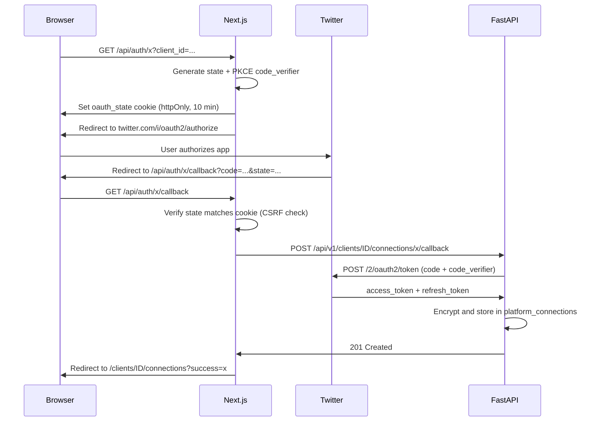

# Epic 5: Platform Connection Setup Guide

This guide walks you through obtaining credentials and configuring all four publishing platforms supported by PersonnaPress: **WordPress**, **Webflow**, **X (Twitter)**, and **LinkedIn**.

---

## How it works at a glance

```mermaid
flowchart TD
    A[User navigates to\n/clients/ID/connections] --> B{Platform}

    B -->|WordPress| C[Inline credential form\nURL + Username + App Password]
    B -->|Webflow| D[Inline token form\nBearer Token → validate → pick Collection]
    B -->|X Twitter| E[OAuth 2.0 PKCE redirect\nvia /api/auth/x]
    B -->|LinkedIn| F[OAuth 2.0 redirect\nvia /api/auth/linkedin]

    C --> G[POST /api/v1/clients/ID/connections\nFastAPI validates via WP REST API]
    D --> H[POST /api/v1/clients/ID/connections\nFastAPI stores token + collection_id]
    E --> I[/api/auth/x/callback\nNext.js verifies state → calls FastAPI\nPOST /clients/ID/connections/x/callback]
    F --> J[/api/auth/linkedin/callback\nNext.js verifies state → calls FastAPI\nPOST /clients/ID/connections/linkedin/callback]

    G --> K[(platform_connections\nAES-256-GCM encrypted)]
    H --> K
    I --> K
    J --> K
```

Credentials are encrypted with AES-256-GCM before storage. The decryption key (`CREDENTIAL_ENCRYPTION_KEY`) lives only on the backend and is never sent to the browser.

---

## Environment variables checklist

### Backend — `backend/.env`

| Variable | Required for | Notes |
|----------|-------------|-------|
| `CREDENTIAL_ENCRYPTION_KEY` | All platforms | Exactly 32 characters. Generate: `openssl rand -base64 24 \| cut -c1-32` |
| `X_CLIENT_ID` | X (Twitter) | From Twitter Dev Portal |
| `X_CLIENT_SECRET` | X (Twitter) | Server-side only — never expose |
| `X_REDIRECT_URI` | X (Twitter) | Must match exactly what you register in Twitter Dev Portal |
| `LINKEDIN_CLIENT_ID` | LinkedIn | From LinkedIn Developers |
| `LINKEDIN_CLIENT_SECRET` | LinkedIn | Server-side only |
| `LINKEDIN_REDIRECT_URI` | LinkedIn | Must match what you register in LinkedIn App |
| `APP_URL` | X + LinkedIn OAuth | **Must exactly match** `APP_URL` in `frontend/.env` |

### Frontend — `frontend/.env.local`

| Variable | Required for | Notes |
|----------|-------------|-------|
| `APP_URL` | X + LinkedIn OAuth | e.g. `http://localhost:3000` — **must match** backend `APP_URL` |
| `BACKEND_URL` | X + LinkedIn callbacks | e.g. `http://localhost:8000` — server-side only |
| `NEXT_PUBLIC_X_CLIENT_ID` | X "Connect" button | Safe to expose (no secret) |
| `NEXT_PUBLIC_LINKEDIN_CLIENT_ID` | LinkedIn "Connect" button | Safe to expose (no secret) |

> **Critical:** `APP_URL` must be identical in both `.env` files, including protocol and no trailing slash. A mismatch causes OAuth redirect URI validation to fail.

---

## WordPress

WordPress uses **Application Passwords** — no OAuth, no developer account needed.

### Step 1: Enable Application Passwords

Application Passwords are built into WordPress 5.6+. If your site runs on WordPress.com or uses certain security plugins, the feature may be disabled.

Verify by navigating to: **WP Admin → Users → [your user] → Application Passwords**. If the section doesn't appear, check your host's documentation.

### Step 2: Create an Application Password

1. Go to **WP Admin → Users → Profile** (or the specific user you want PersonnaPress to post as).
2. Scroll to **Application Passwords**.
3. Enter a name (e.g. `PersonnaPress`) and click **Add New Application Password**.
4. Copy the generated password — it looks like `xxxx xxxx xxxx xxxx xxxx xxxx`. **You cannot view it again.**

### Step 3: Connect in PersonnaPress

1. Navigate to **Clients → [Client] → Platform Connections**.
2. Click **Connect** on the WordPress card.
3. Fill in:
   - **WordPress site URL** — e.g. `https://mysite.com` (no trailing slash)
   - **WordPress Username** — the WordPress login name of the user you created the password for
   - **Application Password** — the 24-character password from Step 2 (spaces included)
4. Click **Connect**.

PersonnaPress validates by calling `/wp-json/wp/v2/users/me` with your credentials before storing anything.

### What gets stored

```json
{
  "site_url": "https://mysite.com",
  "username": "editor",
  "application_password": "xxxx xxxx xxxx xxxx xxxx xxxx"
}
```

This JSON blob is AES-256-GCM encrypted before writing to the database.

---

## Webflow

Webflow uses a **Bearer Token** (from Webflow's API access settings) and a **CMS Collection ID**.

### Step 1: Create a Webflow API token

1. Go to [webflow.com](https://webflow.com) and open the site you want to publish to.
2. Navigate to **Site Settings → Integrations → API access**.
3. Click **Generate API token** (or copy an existing one with CMS write access).
4. Save the token — Webflow shows it once.

> The token needs **CMS write** permissions. Read-only tokens will fail at the publish step.

### Step 2: Find your Collection ID

1. In the Webflow Designer, open **CMS**.
2. Click on the collection you want PersonnaPress to publish blog posts into (usually a "Blog Posts" or "Articles" collection).
3. Open **Collection Settings**.
4. The **Collection ID** appears in the URL or in the Settings panel — it looks like `64abc123def456789012345`.

### Step 3: Connect in PersonnaPress

1. Navigate to **Clients → [Client] → Platform Connections**.
2. Click **Connect** on the Webflow card.
3. Enter your **Webflow API Bearer Token** and click **Validate token**.
   - PersonnaPress calls `/v2/sites` to check the token and then populates a dropdown of your CMS collections.
   - If the API call fails (token expired, network issue), a text input appears so you can enter the Collection ID manually.
4. Select your target collection (or paste the ID manually).
5. Click **Connect**.

### What gets stored

```json
{
  "token": "your-webflow-bearer-token",
  "collection_id": "64abc123def456789012345"
}
```

---

## X (Twitter)

X uses **OAuth 2.0 with PKCE**. You need a Twitter Developer account and an app with write permissions.

### Step 1: Create a Twitter Developer App

1. Go to [developer.twitter.com](https://developer.twitter.com) and sign in.
2. Navigate to **Dashboard → Projects & Apps → New App** (or use an existing app).
3. Under **App permissions**, set to **Read and Write** (required for posting tweets).
4. Under **User authentication settings**, enable **OAuth 2.0**.
5. Set **Type of App** to **Web App, Automated App or Bot**.

### Step 2: Configure the Callback URL

In **App → Settings → User authentication settings → Callback URLs**, add:

```
# Local development
http://localhost:3000/api/auth/x/callback

# Production
https://your-app.vercel.app/api/auth/x/callback
```

> The URL must match `APP_URL` + `/api/auth/x/callback` exactly.

### Step 3: Set the required scopes

In **App → Settings → User authentication settings → Scopes**, enable:

- `tweet.read`
- `tweet.write`
- `users.read`
- `offline.access` — required for refresh tokens

### Step 4: Copy your credentials

Go to **App → Keys and tokens**:

- **Client ID** → `NEXT_PUBLIC_X_CLIENT_ID` (frontend) and `X_CLIENT_ID` (backend)
- **Client Secret** → `X_CLIENT_SECRET` (backend only — never prefix with `NEXT_PUBLIC_`)

### Step 5: Set environment variables

**`backend/.env`:**
```
X_CLIENT_ID=your-client-id
X_CLIENT_SECRET=your-client-secret
X_REDIRECT_URI=http://localhost:3000/api/auth/x/callback
APP_URL=http://localhost:3000
```

**`frontend/.env.local`:**
```
NEXT_PUBLIC_X_CLIENT_ID=your-client-id
X_CLIENT_SECRET=your-client-secret
APP_URL=http://localhost:3000
BACKEND_URL=http://localhost:8000
```

### Step 6: Connect in PersonnaPress

1. Navigate to **Clients → [Client] → Platform Connections**.
2. Click **Connect X** — the button is an `<a>` tag that starts a full-page redirect to Twitter's authorization screen.
3. Authorize the app on Twitter.
4. Twitter redirects back to `/api/auth/x/callback`. The Next.js route verifies the CSRF state cookie, then calls FastAPI to exchange the code for tokens.
5. You land back on the Platform Connections page with a success toast.

### OAuth flow detail



---

## LinkedIn

LinkedIn uses **OAuth 2.0** (standard code flow — no PKCE). You need a LinkedIn Developer app.

### Step 1: Create a LinkedIn App

1. Go to [linkedin.com/developers](https://www.linkedin.com/developers) and click **Create app**.
2. Fill in app name and LinkedIn Page (required — any page you admin will do).
3. Under **Auth** → **OAuth 2.0 scopes**, add:
   - `w_member_social` — required for posting UGC posts

> You must request access to `w_member_social` separately if you don't see it — go to **Products** and request **Share on LinkedIn**.

### Step 2: Configure the Callback URL

In **Auth → Authorized Redirect URLs for your app**, add:

```
# Local development
http://localhost:3000/api/auth/linkedin/callback

# Production
https://your-app.vercel.app/api/auth/linkedin/callback
```

### Step 3: Copy your credentials

Go to **Auth → Application credentials**:

- **Client ID** → `NEXT_PUBLIC_LINKEDIN_CLIENT_ID` (frontend) and `LINKEDIN_CLIENT_ID` (backend)
- **Client Secret** → `LINKEDIN_CLIENT_SECRET` (backend only)

### Step 4: Set environment variables

**`backend/.env`:**
```
LINKEDIN_CLIENT_ID=your-client-id
LINKEDIN_CLIENT_SECRET=your-client-secret
LINKEDIN_REDIRECT_URI=http://localhost:3000/api/auth/linkedin/callback
APP_URL=http://localhost:3000
```

**`frontend/.env.local`:**
```
NEXT_PUBLIC_LINKEDIN_CLIENT_ID=your-client-id
LINKEDIN_CLIENT_SECRET=your-client-secret
APP_URL=http://localhost:3000
BACKEND_URL=http://localhost:8000
```

### Step 5: Connect in PersonnaPress

1. Navigate to **Clients → [Client] → Platform Connections**.
2. Click **Connect LinkedIn**.
3. Authorize on LinkedIn.
4. You're redirected back to `/api/auth/linkedin/callback`. Next.js verifies the CSRF state cookie, then calls FastAPI to exchange the code.
5. FastAPI calls `/v2/userinfo` to retrieve your display name, stores the encrypted token, and you land back on the connections page.

---

## Generating the encryption key

Every platform's credentials are encrypted at rest with AES-256-GCM. Generate a key before connecting any platform:

```bash
# Option 1: openssl (recommended)
openssl rand -base64 24 | cut -c1-32

# Option 2: Python
python3 -c "import secrets; print(secrets.token_hex(16))"
```

Set the result in **both** `.env` files:

```
# backend/.env
CREDENTIAL_ENCRYPTION_KEY=abcdef1234567890abcdef1234567890

# (Frontend does not need this key — decryption happens only in services/publishing.py)
```

> **Key rotation:** If you change `CREDENTIAL_ENCRYPTION_KEY`, all existing platform connections become unreadable. You will need to disconnect and reconnect every platform.

---

## Troubleshooting

### "WordPress returned 401 — check your Application Password"

- Confirm the username matches exactly the WordPress login name (not the display name).
- Application Passwords are user-specific. The password you created under User A won't work for User B.
- Some security plugins (Wordfence, iThemes Security) block Application Passwords — check your plugin settings.
- WordPress.com hosted sites require a separate setup; Application Passwords work differently there.

### Webflow: "no Webflow sites found for this token"

- The token must have **CMS write** access, not read-only.
- Tokens scoped to a specific site won't list sites via the `/v2/sites` endpoint — re-generate a token with all-sites access.
- If you have multiple Webflow sites, PersonnaPress picks the **first** site returned by the API. Generate a token scoped to the correct site to control which site is selected.

### X OAuth: redirect mismatch error

- The `APP_URL` in `backend/.env` and `frontend/.env.local` must be identical.
- The redirect URI registered in the Twitter Dev Portal must match `APP_URL + /api/auth/x/callback` exactly.
- Trailing slashes cause mismatches — `https://myapp.com` ≠ `https://myapp.com/`.

### LinkedIn: "OAuth scope error" or "unauthorized_scope_error"

- `w_member_social` is not enabled by default. Go to **LinkedIn Developers → Your App → Products** and request **Share on LinkedIn**.
- LinkedIn app review can take 1–3 business days.

### General: "Authorization failed — the request was tampered with"

The `oauth_state` CSRF cookie expired (10-minute window) or was cleared between the redirect and the callback. Start the OAuth flow again by clicking **Connect X** or **Connect LinkedIn** — do not use the browser back button mid-flow.

---

## Disconnect a platform

From **Clients → [Client] → Platform Connections**:

1. Click **Disconnect** on any connected card.
2. Confirm in the dialog — "Disconnect [Platform]? Future campaigns will not publish to this platform."
3. The `platform_connections` row is deleted from the database. Encrypted credentials are not retained.

Disconnecting does not revoke the OAuth token at the provider. To fully revoke X access, go to **twitter.com → Settings → Security → Apps and sessions → Connected apps**. For LinkedIn, go to **LinkedIn → Settings → Data Privacy → Other applications**.

---

## Local development tips

- For WordPress and Webflow, local credentials work the same as production — no extra config needed.
- For X and LinkedIn OAuth, the callback must be reachable by the browser. `http://localhost:3000` works when running the Next.js dev server locally and both platforms accept `localhost` redirect URIs.
- The `oauth_state` cookie is `SameSite=Lax` and `Secure` only in production. In development, it works over `http://localhost` without `Secure`.
- Run the backend and frontend concurrently. The Next.js callback routes call FastAPI server-side at `BACKEND_URL` — if FastAPI is not running, the callback will fail with a connection error.
